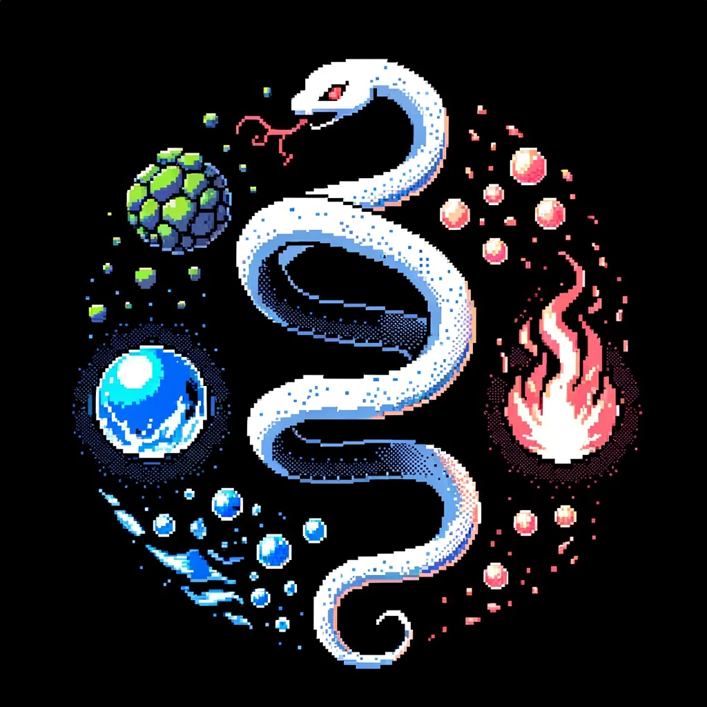

# Godai - Elemental Serpent

Dive into the world of Godai, a game that brings the classic concept of the snake to the blockchain, but with a twist. Command a serpent made up of interconnected blocks that roams in three-dimensional space. Your mission? Traverse this vast expanse, gathering blocks to lengthen your serpent while competing against other formidable serpents.

But that's not all. Embark on a strategic journey with elemental blocks, each waiting to be consumed. These blocks not only transform your serpent's attributes but also introduce a hierarchy of elemental powers. Every element boasts its own strengths and vulnerabilities against others. Should your serpent, supercharged by a dominant element, encounter a lesser one, the lesser serpent will fracture at the point of clash. Navigate this elemental chessboard and reign supreme!

This fully onchain game is built using the awesome [Dojo Engine](https://github.com/dojoengine/dojo). 